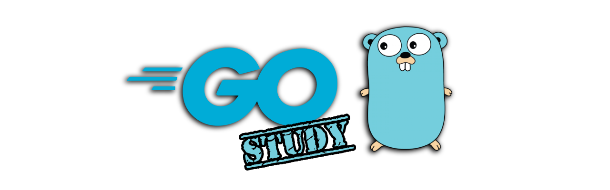

# curso-golang-udemy

## **História e Características da Linguagem**

A linguagem foi apresentada ao mundo em Novembro de 2009 por Robert Griesemer, Rob Pike e Ken Thompson. A versão 1.0 da linguagem foi apresentada em Março de 2012 como um projeto de código livre/aberto.

O que levou os engenheiro a criar uma nova linguagem, foi a necessidade de ter uma linguagem que tenha um excelente desempenho e otimização, dado que eles sempre trabalharam com C++. Porém, o C++ traz diversas dificuldades como tempo de compilação, a complexidade da linguagem em si, com muitas formas de resolver o mesmo problema.

O Google percebeu essa necessidade de ter uma linguagem melhor para os seus produtos. Essa linguagem, precisava ser limpa, pequena, compilada e moderna.

Os princípios da linguagem é que ela precisa ser simples, segura e legível. Por isso, eles queriam uma linguagem mínima (ou seja, com uma única forma de escrever o código).

O Go não é uma linguagem orientada a objetos, mas traz algum recursos desse paradigma como métodos, interfaces e polimorfismo. Ele foi inspirado na linguagem smalltalk.

A parte de concorrência que foi inserida no Go, se baseou na linguagem (NewSqueak - Rob Pike). 

É uma linguagem fortemente tipada e compilada.

## **Fundamentos**

### Variáveis de Ambiente

Quando você digita `go env` no terminal, você tem acesso as variáveis de ambiente do Go.

`GOPATH`

Local onde vai ter o workspace com o seus projetos.

`GOROOT`

Local onde o Go foi instalado.

Você pode também diretamente pegar informações de uma variável de ambiente passando o nome dela como argumento do comando env. Por exemplo: `go env GOPATH`.

## **Linhas de Comando**

`go get`

`go version`

`go version`

Habilitar a documentação offline:
`godoc -http=:6060`

`go env`

`go doc cmd/vet`

O comando `go vet` faz com que aponte algumas coisas suspeitas/erradas no código em questão. 

`go build`

`go run`

Compila e já executa o programa

## **Referências**

### Documentação

  - [https://go.dev/doc/code](https://go.dev/doc/code)

### Cursos

- [Repositório do Curso](https://github.com/cod3rcursos/curso-go)

